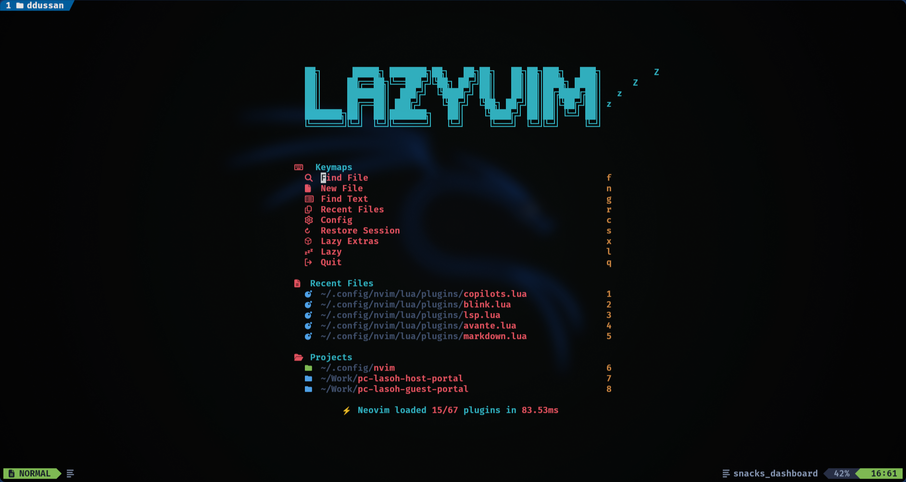
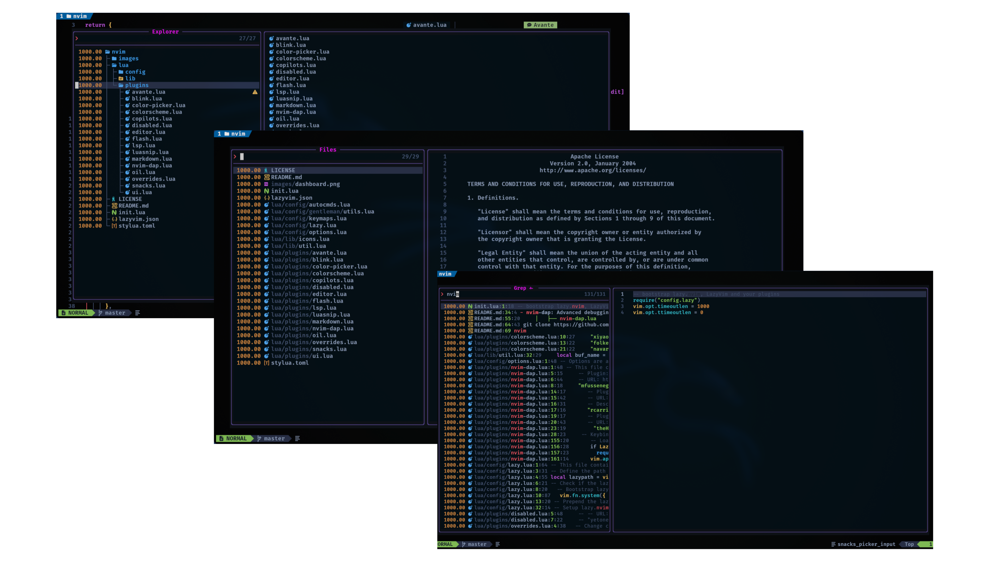
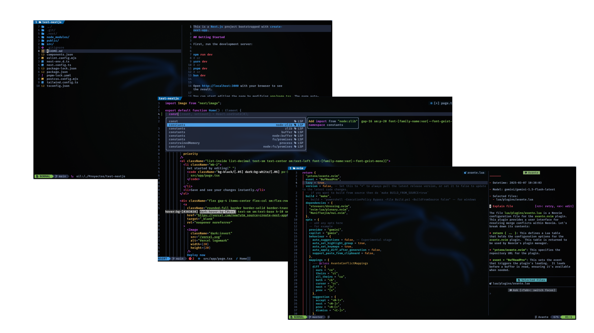

# 🚀 Neovim Configuration

> My personal Neovim configuration, based on LazyVim with additional customizations for development and productivity.

## ✨ Features

- 🎨 Custom theme and enhanced UI
- 🔍 Smart search and navigation with Flash
- 🛠️ Complete LSP support
- 🐍 Integrated debugging with DAP
- 🤖 AI assistance with Avante (Gemini) and Supermaven
- 📝 Intelligent autocompletion system with Blink-cmp
- 🎯 File management with Oil

## 📸 Preview

### Dashboard
A modern and clean dashboard with quick access to recent files and custom actions.
<div align="center">
  
</div>

<details>
<summary><strong>Snacks Plugin Integration</strong></summary>

Powerful file navigation and search capabilities:
- Tree-style file explorer for project navigation
- Quick file search by name across the project
- Full-text search across all project files
- Integrated with fuzzy finder for fast results

</details>

<details>
<summary><strong>Oil, Blink-cmp and Avante Integration</strong></summary>

Seamless file management with Oil, intelligent code completion with Blink-cmp, and AI assistance with Avante.

</details>

## 🔌 Main Plugins

### UI and Themes
- **Colorscheme**: Custom theme configuration
- **Avante**: AI chat integrated with Google's Gemini, enabling direct AI interaction from the editor
- **Blink-cmp**: Advanced autocompletion system integrating:
  - LSP suggestions
  - LuaSnip snippets
  - Code suggestions with Codeium
  - Intelligent contextual autocompletion

### Productivity
- **Oil**: Integrated file manager
- **Flash**: Fast and efficient navigation
- **Color Picker**: Integrated color selector
- **Supermaven**: AI code assistant for suggestions and completion

### Development
- **LSP**: Complete configuration for multiple languages
- **nvim-dap**: Advanced debugging
- **LuaSnip**: Extensible snippet system

### Markdown
- Enhanced Markdown editing support
- Integrated previewer

## ⚙️ Configuration

The configuration is organized in several files within `lua/`:

```
└── lua/
    ├── config/
    ├── plugins/
    │   ├── avante.lua
    │   ├── blink.lua
    │   ├── colorscheme.lua
    │   ├── copilots.lua
    │   ├── editor.lua
    │   ├── lsp.lua
    │   ├── nvim-dap.lua
    │   └── ...
    └── lib/
```

## 🚀 Installation

### Prerequisites

Make sure you have these dependencies installed:

#### Core Tools
Install these essential tools (use your preferred package manager):

```bash
# Using apt
sudo apt install neovim lazygit fzf

# Using brew
brew install neovim lazygit fzf

```

#### Required System Packages
```bash
sudo apt install git ripgrep fd-find nodejs npm
```

#### Language Servers & Formatters
```bash
# Install global npm packages
npm install -g prettier typescript typescript-language-server
```

### Setup

1. Clone this repository:
```bash
git clone https://github.com/danieldussan/nvim-dots.git ~/.config/nvim
```

2. Start Neovim and wait for plugins to install:
```bash
nvim
```

The first startup might take a few minutes as it installs all plugins and language servers.

## 🎨 Customization

You can customize the configuration by editing the files in `lua/plugins/`. Each plugin has its own modular configuration.

## 📚 References and Acknowledgments

- [LazyVim](https://github.com/LazyVim/LazyVim)
- [Neovim](https://neovim.io/)
- [Gentleman-Dots](https://github.com/Gentleman-Programming/Gentleman.Dots/tree/main)
- [Linkarsu](https://github.com/linkarzu/dotfiles-latest)
<!-- Add more inspiring configuration references -->

## 📝 License

This project is under the MIT license. See the [LICENSE](LICENSE) file for more details.