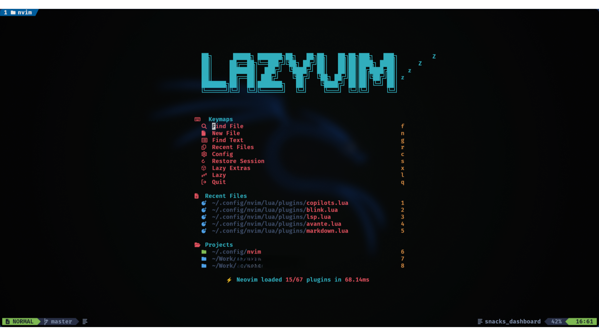

# 🚀 Neovim Configuration

> My personal Neovim configuration, based on LazyVim with additional customizations for development and productivity.

## ✨ Features

- 🎨 Custom theme and enhanced UI
- 🔍 Smart search and navigation with Flash
- 🛠️ Complete LSP support
- 🐍 Integrated debugging with DAP
- 🤖 AI assistance with Avante (Gemini) and Supermaven
- 📝 Intelligent autocompletion system with Blink-cmp
- 🎯 File management with Oil

## 🔌 Main Plugins

### UI and Themes
- **Colorscheme**: Custom theme configuration
- **Avante**: AI chat integrated with Google's Gemini, enabling direct AI interaction from the editor
- **Blink-cmp**: Advanced autocompletion system integrating:
  - LSP suggestions
  - LuaSnip snippets
  - Code suggestions with Codeium
  - Intelligent contextual autocompletion

### Productivity
- **Oil**: Integrated file manager
- **Flash**: Fast and efficient navigation
- **Color Picker**: Integrated color selector
- **Supermaven**: AI code assistant for suggestions and completion

### Development
- **LSP**: Complete configuration for multiple languages
- **nvim-dap**: Advanced debugging
- **LuaSnip**: Extensible snippet system

### Markdown
- Enhanced Markdown editing support
- Integrated previewer

## ⚙️ Configuration

The configuration is organized in several files within `lua/`:

```
└── lua/
    ├── config/
    ├── plugins/
    │   ├── avante.lua
    │   ├── blink.lua
    │   ├── colorscheme.lua
    │   ├── copilots.lua
    │   ├── editor.lua
    │   ├── lsp.lua
    │   ├── nvim-dap.lua
    │   └── ...
    └── lib/
```

## 🚀 Installation

1. Clone this repository:
```bash
git clone https://github.com/YOUR_USERNAME/nvim-dots.git ~/.config/nvim
```

2. Start Neovim and wait for plugins to install:
```bash
nvim
```

## 📸 Screenshots

<div align="center">
  <div style="display: grid; grid-template-columns: repeat(2, 1fr); gap: 10px; margin-bottom: 10px;">
    
    
  </div>
  <div style="display: grid; grid-template-columns: repeat(2, 1fr); gap: 10px;">
    
    
  </div>
</div>

## 🎨 Customization

You can customize the configuration by editing the files in `lua/plugins/`. Each plugin has its own modular configuration.

## 📚 References and Acknowledgments

- [LazyVim](https://github.com/LazyVim/LazyVim)
- [Neovim](https://neovim.io/)
<!-- Add more inspiring configuration references -->

## 📝 License

This project is under the MIT license. See the [LICENSE](LICENSE) file for more details.